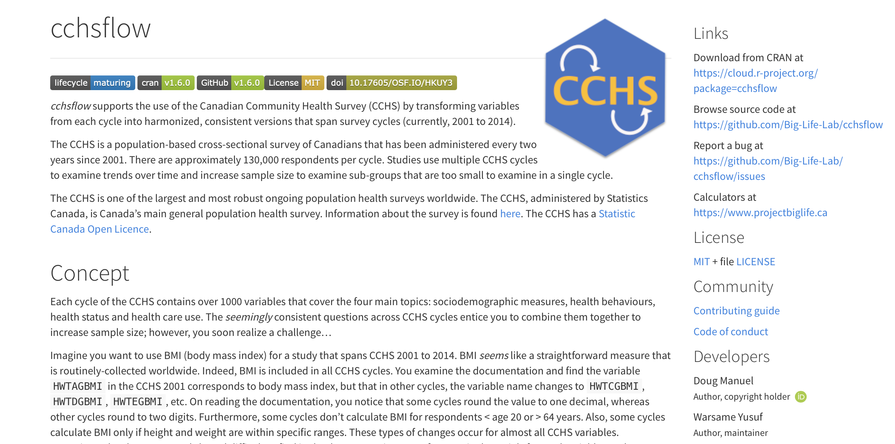

```{r setup, include=FALSE}
knitr::opts_chunk$set(echo = TRUE)
```
## Introduction

You are a public health epidemiologist who would like to report the change in Body Mass Index (BMI) in your health unit over the past 15 years. You review the codebook for the Canadian Community Health Survey (CCHS) and note that BMI is collected. BMI _seems_ like a straightforward measure that is routinely collected worldwide.[@StatisticsCanada2001] Indeed, BMI is included in all CCHS cycles. You examine the documentation and find the variable HWTAGBMI in the CCHS 2001 corresponds to body mass index, but that in other cycles, the variable name changes to HWTCGBMI, HWTDGBMI, HWTEGBMI, etc. On reading the documentation, you notice that some cycles round the value to one decimal, whereas other cycles round to two digits. Furthermore, some cycles don’t calculate BMI for respondents under the age of 20 or over the age of 64 years. Also, some cycles calculate BMI only if height and weight are within specific ranges. After spending hours on the task, you talk with a colleague in a neighbouring health unit. They did the same task a few years ago. You share your Stata code by email and compare notes, only to realize that you both had different approaches, each with errors. 

## Objective

We created process called _cchsflow_ to minimize the amount of time public health epidemiologists and others spend cleaning and transforming CCHS variables across multiple survey cycles. Currently, _cchsflow_ currently harmonizes 160 variables for 1,092,951 survey respondents of the CCHS Public Use Microdata File (PUMF) from 2001 to 2014.

We sought to use an science approach for the development of _cchsflow_. Open science is the movement to improve research reproducibility, accessibility, and collaboration.[@Ross2013] Public health practice strives for these qualities and can potentially benefit from the same tools used to support open science. _cchsflow_ was developed to allow users the ability to contribute to the package, including making suggestions and requests, and identify errors. People can also "fork" the package meaning they can use the _cchsflow_ approach to harmonize other databases. _cchsflow_ uses R language package since R is the most commonly used open statistical programming language. The core of _cchsflow_, however, are references files that could be used in other programming languages.

Even this paper was created using the open science principles that were used for _cchsflow_. This paper was written using R markdown - a notebook that allows R code to be executed within the document. Both the _cchsflow_ R package and this paper's notebook is available on [GitHub](https://github.com/Big-Life-Lab/cchsflow/blob/paper-writeups/papers/CJPH/cjph-paper.Rmd) which allows readers to make comments, suggestions or note errors. Readers can execute or modify all examples in this paper in R.

## Background

### Cleaning and transforming CCHS datasets

Data cleaning, including transforming variables into harmonized or common variables, is typically the most time consuming part of data analyses. According to Dasu & Johnson, 80% of data analysis is spent on data cleaning.[@Dasu2003] With the CCHS, data cleaning and harmonization issues arise when combining CCHS surveys for longitudinal analysis. Currently, there is no standardized method or tool used to combine CCHS survey cycles. Health units across Canada that use the CCHS do their own data cleaning and preparation, taking time away from other data analysis.   

### Open science and its benefits to public health practice

Open science is defined as "transparent and accessible knowledge that is shared and developed through collaborative networks".[@Vicente-Saez2018] Included in open science is: open data, data that is publicly accessible such as the CCHS with Statistics Canada's new Open License[@stc_open]; open source, the use of open access programs such as data science languages including R, Python and Julia, and; open methodology, program code that is publicly accessible and shared through on-line repositories such as GitHub or GitLab.[@McKiernan2016; @Stodden2013] In public health, there has been a marked trend toward open data and sharing code - notably during the covid-19 pandemic.[@moorthy2020data]

Adopting open science practices comes with well-described benefits.[REFS] McKiernan et al. found that open science is associated with increased research exposure in both media and in citations; and an increase in collaboration, funding, and job opportunities.[@McKiernan2016] For public health professionals, an open science approach and toolkit facilitates collaboration as it allows for data & coding methods to be shared between different health units. Additional benefits include improved transparency, accessibility, efficiency, reduced coding errors and faster analyses. As in other sectors, public health practitioners can use open science tools to potentially improve and compress many time consuming, repetitive, inconsistent analyses tasks.

## Methods

_cchsflow_ followed the approach of the Open Source Initiate and open software for research.[@OpenSourceInitiative2020; @JournalofOpenSourceSoftware2018] _cchflow_ was created in R with provisions to support other program languages such as Stat or SAS.[@cchsflow] The package currently supports the first 10 cycles of the CCHS PUMF surveys from 2001 to 2013, in which the variables of each were harmonized and transformed to use the same set of variables. In _cchsflow_, variables were renamed to the variable names used in CCHS cycles from 2007 to 2014 as they have shown to be most consistent. 

### Selection of variables

Variables included in _cchsflow_ include three categories: health behaviours, sociodemographic information, and health status. There are provisions and instructions how users can contribute or request the addition of new variables. 

In Gochman's handbook on health behaviour research, he defines health behaviours as "overt behavioral patterns, actions and habits that relate to health, to health restoration and to health improvement".[@Gochman1997] This definition encompasses a wide variety of behaviours such as, smoking, alcohol, diet, and physical activity.[@Conner2017] For this project, the aforementioned behaviours were examined using existing CCHS variables, as well as derived variables. With respect to sociodemographic information, variables such as age, sex, immigration status, country of birth, time spent in Canada, ethnicity, education (individual and highest family), income (adjusted for province and inflation), home ownership, and marital status were collected and added to the _cchsflow_ library. According to Shah, health status can be defined as "[t]he degree to which a person is able to function physically, emotionally, socially, with or without aid from the healthcare system.".[@Shah2003] Within this definition of health status lies health conditions, human function, well-being, and deaths. Within this project, variables relating to health conditions, human function, and well-being were collected. Deaths were not collected as CCHS data included only living respondents.   

### Variable mapping

CCHS variables were transformed and into a common from across the 10 survey cycles. For many variables, the only difference between cycles were their variable name; as such, only a name change was required to standardize a variable across the 10 cycles. 

Changes in the number and type of categories was also common. For example, in the 2001 and 2003 CCHS survey cycles, there were 15 age categories; while in CCHS survey cycles from 2005 to 2014, there were 16 age categories. There were two options for such variable category changes. The first option was to create a harmonized variable by collapsing categories into common forms. The second option maintained separate variables. For age we also included a third option to maximize age information by deriving a new continuous age variable was derived that takes the midpoint of each age category for all cycles.

There were also changes to question wording, missing categories, inclusion and exclusion criteria. Variables where not included in all cycles or all health regions.  We included harmonized variables when there was a consensus among developers that the differences across cycles where small. _notes_ are included when any difference was identified, with a default to print all notes during transformations.

### Transformation of variables through specification worksheets

Two worksheets are included in the _cchsflow_ packages that contain variable information and metadata:  *variables.csv* specifies all the variables in the package. *variable_details.csv* specifies CCHS data that contain the variables, the variable type, and the category structure. 

_rec_with_table()_, short for 'recode with table' is the key function to transform variables. _rec_with_table()_ uses the two worksheets to create a transformed data from a CCHS cycle. Once all CCHS survey cycles have been transformed, they can combined to create one large transformed data set that spans across the 10 CCHS survey cycles. The two CSV worksheets also has variable labels and other metadata that can be added to the data using the _rec_with_table()_ function. 

### Derived variables

CCHS includes derived variables that were created using multiple responses and variables. BMI is an example of an original CCHS derived variable that was calculated using self-reported height and weight. Several new derived variables were included including were also generated in the _cchsflow_ package and there are provisions and instructions for adding additional variables. These variables were based on derived variables used in previous studies and include smoking pack-years, binge drinking and diet pattern.[@Manuel2016] 
 
```{r, echo=FALSE}
library(DiagrammeR)
flowchart <- grViz("digraph flowchart {
              graph [layout = dot, overlap = true, ranksep = 1, nodesep = 1]
              # node definitions with subtituted label text
              node [shape = rectangle, fontsize = 50]
              tab1 [label = '@@1']
              tab2 [label = '@@2']
              tab3 [label = '@@3']
              tab4 [label = '@@4']
              tab5 [label = '@@5']
              tab6 [label = '@@6']
              tab7 [label = '@@7']
              tab8 [label = '@@8']
              tab9 [label = '@@9']
              
      
              # edge definitions with the node IDs
              tab1 -> tab2 -> tab3 
              tab3 -> tab5 [label = ' Yes', fontsize = 50]
              tab3 -> tab4 [label = ' No', fontsize = 50]
              tab4 -> tab6 [label = ' Yes', fontsize = 50]
              tab4 -> tab8 [label = ' No', fontsize = 50]
              tab5 -> tab9 [label = ' Yes', fontsize = 50]
              tab5 -> tab7 [label = ' No', fontsize = 50]
              }
      
              [1]: 'Identify a variable to be\\nadded to cchsflow.'
              [2]: 'Identify which CCHS survey\\ncycles this variable is in.'
              [3]: 'Are the categories consistent\\nacross cycles?'
              [4]: 'Can categories be collapsed to\\nbecome consistent? Or can it be converted into\\na categorical variable?'
              [5]: 'Are the variable names\\nconsistent across cycles?'
              [6]: 'Create a derived categorical variable\\nwith collapsed categories for all cycles;\\nor create a derived continuous variable using\\nmidpoints of each category.'
              [7]: 'Rename variable to common name\\nused from 2007-2014.'
              [8]: 'Cannot harmonize into one final variable.\\nCombine variables that are consistent.'
              [9]: 'No transformations needed, specify\\nwhich survey cycles variable is in.'
              ",
              height = 750
              )

flowchart
```

**Figure 1**: Flowchart of how CCHS variables to where added to cchsflow. Users can add variables using the same approach.
 
### Collaboration with other users


### Documentation

Open source, web-based documentation is available at [https://big-life-lab.github.io/cchsflow/](https://big-life-lab.github.io/cchsflow/)
and includes a searchable reference of all transformation, vignettes of examples of how to perform transformations, collaboration principles, a development roadmap.



**Figure 2:** The homepage for the cchsflow GitHub repository.

## Results

The _cchsflow_ is available on Comprehensive R Archive Network (CRAN), a network of servers that contain documentation for R packages.[@CRAN2020; @cchsflow] The _cchsflow_ package contains the following items: the *variables.csv* worksheet, the *variable_details.csv* worksheet, the various functions, and subsets of 200 respondents for each CCHS cycle.

**Figure 3a** illustrates the command line to install the CRAN version of _cchsflow_, while **Figure 3b** illustrates the command to install the development version of _cchsflow_, which is a more up to date version of the package.

```{r, eval=FALSE}
install.packages("cchsflow")
```
**Figure 3a:** The command line to install the _cchsflow_ package that is currently saved on CRAN.

```{r, eval=FALSE}
devtools::install_github("Big-Life-Lab/cchsflow")
```
**Figure 3b:** The command line to install the development version of _cchsflow_ from Github.

### Recode with table

The _rec_with_table()_ function is used to recode or transform variables based on the information from the two specification worksheets. The function has the ability to transform an entire data set, or a subset of variables. **Figure 4a** illustrates how to load the _cchsflow_ package, the 2001 CCHS data and then transform all variables in _cchsflow_ to their harmonized version.  The _cchsflow_ package comes with a subsample of CCHS data for 2001 to 2013 versions, made possible with Statistics Canada new Open Lincence.[@StatisticsCanada2019]. **Figure 4b** illustrates how to transform a subset of variables from the 2001 survey cycle.    

```{r, eval=FALSE}
library(cchsflow)
cchs2001 <- read.csv("~/data/cchs2001.csv")
transformed_cchs <- rec_with_table(cchs2001)
```
**Figure 4a:** The command lines to load the _cchsflow_ package, load the 2001 CCHS PUMF data and then transform the all variables in the worksheets using the _rec_with_table()_ function. 

```{r, eval=FALSE}
library(cchsflow)
cchs2001 <- read.csv("~/data/cchs2001.csv")
transformed_cchs2001 <- rec_with_table(cchs2001, c("DHH_SEX", "DHHGAGE_cont"))
```
**Figure 4b:** The command lines to transform the sex & age variables using the _rec_with_table()_ function.

## Discussion

_cchsflow_ R package harmonizes and transforms CCHS data from 2001 to 2014.[@cchsflow] _cchsflow_ provides public health epidemiologists and others the ability to more robustly analyze over 1 million respondents across a 13 year period to examine trends in health indicators. The use of an open science approach improves collaboration, transparency and efficiency when transforming variables. The package allows public health professionals that use CCHS to spend less time on data cleaning, and spend more time on analysis such as surveillance and health status reporting. 

### Comparison to other projects
A consistent approach to calculate health indicators is a long-standing public health goal. _cchsflow_ uses an open science approach to build from and support several related health indicator and harmonization projects that use CCHS data including the Canadian Institute for Health Information indicator library, the Public Health Agency of Canada health inequality reports, Ontario's Public Health Indicator Working Group, and Manitoba Centre for Health Policy Concept Dictionary and recent algorithm harmonization initiative from the new SPOR Canadian Data Platform.[@CIHI_HI; @AssociationofPublicHealthEpidemiologistsinOntario2018; @Pan-CanadianPublicHealthNetwork2018; @MCHP_concept; @HealthDataResearchNetworkCanada2020] These initiatives typical include the definition of indicators but it is uncommon to publish how to calculate indicators using CCHS data, especially across CCHS cycles. _cchsflow_ an provides open, reusable, accessible, collaborative approach to calculate indicators using the CCHS. 

_cchsflow_ facilitates the use CCHS metadata for public health. Metadata is increasingly recognized as helpful data infrastructure to support open science and data harmonization. Metadata is "data about data" and includes information about variable and category labels, types, and provenance (how the data was collected and transformed).[@mcgilvray2008executing; duval2002metadata] The CCHS comes with Data Documentation Initiative (DDI) metadata.[@vardigan2008data] DDI metadata is available for over 10 thousand different surveys and research projects worldwide.[@DDI] There is also initiatives such as Maelstrom that is used by other Canadian health surveys to improve the use of metadata.[@bergeron2018fostering] 

To our knowledge public health practitioners seldom use metadata beyond variable labels in their analyses work flow. Barriers to use metadata in public health include the lack of well-organized metadata in public health data and a lack of metadata analysis tools such as _cchsflow_. It is commendable that DDI documents are included with CCHS, but the not all metadata is included or consistent. Support for variable transformation is robustly supported in newer versions of DDI that are not yet available for the CCHS. _cchsflow_ uses DDI documents to create the worksheets with the added benefit of harmonizing and transforming metadata across CCHS cycles. _cchsflow_ transformations also support the use of Predictive Modeling Markup Language (PMML).[PMML reference] Our team uses _cchsflow_'s PMML metadata in public health planning tools that calculate life expectancy and chronic disease risk for public health regions.[BLL planning tool reference]

### Limitations and challenges

While the CCHS has many consistent variables across survey cycles, there are differences between cycles that can sometimes be irreconcilable or difficult to harmonize. Within _cchsflow_, variables with irreconcilable differences were either transformed into a new derived variable, or kept as separate variables that can be only be used in select cycles. Along with variables with irreconcilable differences, there are variables in _cchsflow_ that were not asked in all CCHS cycles. This means for some variables, data does not span across the length of the CCHS cycles available in _cchsflow_. A possible solution is to impute missing variables, where missing data is replaced with values on based on other respondents and responses to other variables.

_cchsflow_ has been used in a range of projects but care must be taken to understand how specific variable transformation and harmonization with _cchsflow_ affects each use of CCHS data. Across survey cycles, almost all CCHS variables have had at least some change in wording and category responses. Furthermore, there have been changes in survey sampling, response rates, weighting methods and other survey design changes that affect responses. Combining CCHS across survey cycles will result in misclassification error and other forms of bias that affects studies in different ways.

### Collaboration with other users

Collaboration is facilitated using GitHub, the most popular on-line code repository with over 45 million users. Github is based on the Git version-control system which, in turn, is a cornerstone of open software development.[@Dabbish2012]

The open-access nature of the _cchsflow_ package also allows users to add other CCHS variables that might benefit others. There is complete transparency on how the package was developed as the entire source code for the package is publicly accessible on the repository. Along with being transparent, putting the _cchsflow_ package on GitHub offers users of the package the opportunity to provide feedback on how to further improve the package. In the issues section of the GitHub repository, users can submit bug reports where they can identify issues they are encountering while using the package. Users add new variable transformations using the worksheets and then create a 'pull request' or PR to add the transformation to the main _cchsflow_ package. Users can also request variables to be added or identify issues using the 'issues' feature. All _cchsflow_ documentation (and this paper write up) are also open-access and available on the GitHub repository. Users can make comments, identify errors, add vignettes and examples.

GitHub provides benefit to users in that it provides them an opportunity to implement better practices in their own code [@Dabbish2012]. The implementation of GitHub in the development of _cchsflow_ allows public health professionals across Canada to collaborate and share potential variables that can be useful for health surveillance and health status reporting. 

### Roadmap

A roadmap, also known as milestones, next steps or future plans, are recommended for open software projects. _cchflow_ includes a roadmap and milestones on the [project website](https://github.com/Big-Life-Lab/cchsflow/projects). At time of writing, the roadmap includes the adding the 'share' version of CCHS that is used in Statistics Canada Regional Data Centres and other settings, ability compare variable frequency across survey cycles and improved metadata support. _cchsflow_ has been forked by related projects to support other data sets. The expanded use of _cchsflow_ for related projects is a halmark of open science and demonstration of how an open science leads to expanded science and public health resources. 

### Conclusion

Open science and the open science toolkit is transforming science and has been invaluable in public health emergencies such as covid-19. _cchsflow_'s open science also allows public health professionals to collaborate and share their work with other colleagues, saving time recoding and cleaning health datasets. By implementing open science practices, _cchsflow_ aims to minimize the amount of time needed to clean and prepare CCHS data for the many CCHS users in health units across Canada.

\pagebreak

## References
